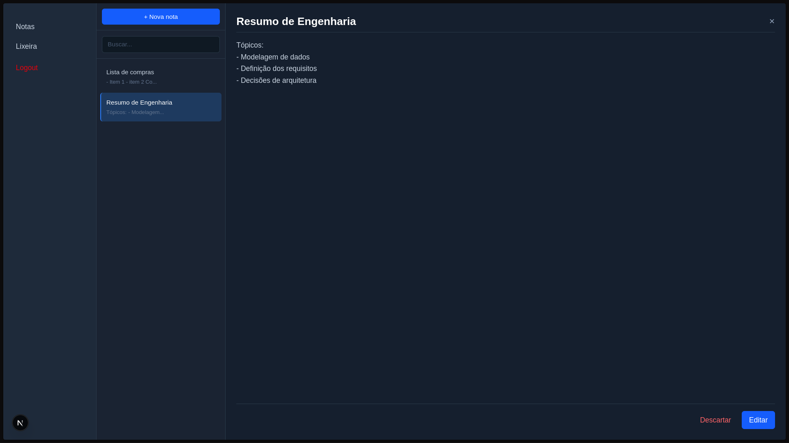

# MyNotes

Aplicação full-stack para gerenciamento de notas pessoais, com autenticação JWT, CRUD completo e lixeira com recuperação de notas.

## Demonstração

<p align="center">
  
</p>
> Deploy em breve

---

## Stack

**Backend**
- Node.js + Express
- PostgreSQL + Prisma ORM
- JWT para autenticação
- Vitest para testes

**Frontend**
- Next.js 15 + TypeScript
- Tailwind CSS
- Context API para estado global

**Infraestrutura**
- Docker + Docker Compose

---

## Funcionalidades

- Cadastro e login de usuários
- Autenticação via JWT com persistência de sessão
- Criação, edição e exclusão de notas
- Lixeira — mover, recuperar e deletar permanentemente
- Busca local de notas por título e conteúdo
- Layout responsivo — desktop e mobile
- Proteção de rotas privadas
- Logout com limpeza de sessão

---

## Arquitetura

```
mynotes/
├── backend/
│   ├── src/
│   │   ├── controllers/
│   │   ├── services/
│   │   ├── repositories/
│   │   ├── middlewares/
│   │   ├── routes/
│   │   └── config/
│   └── prisma/
└── frontend/
    └── src/
        ├── app/
        ├── components/
        ├── lib/
        │   ├── api/
        │   ├── hooks/
        │   └── types/
        └── providers/
```

O backend segue separação por camadas — controllers recebem requisições, services contêm regras de negócio, repositories acessam o banco via Prisma.

O frontend separa responsabilidades entre páginas (rotas), componentes (UI), hooks customizados (lógica) e providers (estado global).

---

## Rodando localmente

### Pré-requisitos

- Docker e Docker Compose instalados

### Configuração

1. Clone o repositório:

```bash
git clone https://github.com/seu-usuario/mynotes.git
cd mynotes
```

2. Crie o arquivo `.env` na raiz com as variáveis:

```env
# Banco de dados
POSTGRES_USER=postgres
POSTGRES_PASSWORD=sua_senha
POSTGRES_DB=mynotes
POSTGRES_HOST=db
POSTGRES_PORT=5432
DATABASE_URL=postgresql://postgres:sua_senha@db:5432/mynotes

# Backend
JWT_SECRET=seu_jwt_secret
NODE_ENV=development
PORT=3000

# Frontend
NEXT_PUBLIC_API_URL=http://localhost:3000

# CORS
FRONTEND_URL=http://localhost:3001
```

3. Suba os containers:

```bash
docker compose up --build
```

4. Em outro terminal, rode as migrations do banco:

```bash
docker compose exec app npx prisma migrate deploy
```

5. Acesse:
   - Frontend: `http://localhost:3001`
   - Backend: `http://localhost:3000`

---

## API

### Autenticação

| Método | Rota | Descrição |
|--------|------|-----------|
| POST | `/auth/register` | Cadastro de usuário |
| POST | `/auth/login` | Login — retorna JWT |

### Notas (requer JWT)

| Método | Rota | Descrição |
|--------|------|-----------|
| GET | `/notes` | Listar notas ativas |
| GET | `/notes/:id` | Buscar nota por ID |
| POST | `/notes` | Criar nota |
| PUT | `/notes/:id` | Editar nota |
| PATCH | `/notes/:id` | Mover para lixeira |
| GET | `/notes/trash` | Listar lixeira |
| PATCH | `/notes/trash/:id/recover` | Recuperar da lixeira |
| DELETE | `/notes/trash/:id` | Deletar permanentemente |

Todas as rotas de notas exigem o header:
```
Authorization: Bearer <token>
```

---

## Testes

```bash
# Dentro do container do backend
docker compose exec app npm test
```

---

## Segurança

- Senhas armazenadas com bcrypt
- JWT com expiração de 2h
- Rate limiting nas rotas de autenticação
- Sanitização de inputs nas notas
- Isolamento de dados por usuário — um usuário não acessa notas de outro
- Erros internos não expostos ao cliente


## Autor

Felipe — estudante de Análise e Desenvolvimento de Sistemas, Aracaju/SE.